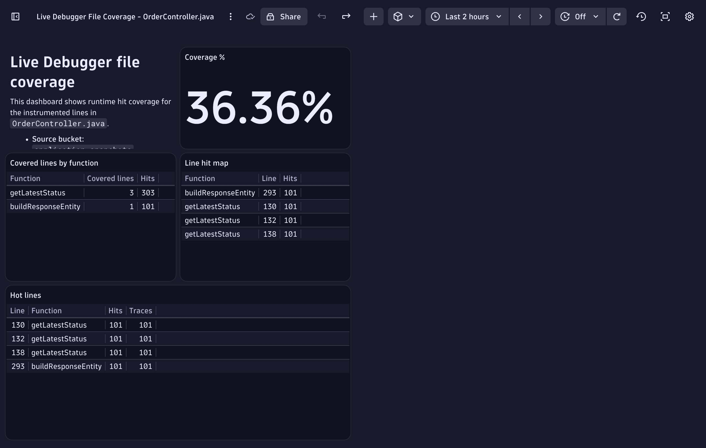

# Building the Dashboard

--8<-- "snippets/bizevent-building-dashboard.js"

Steps 6–9 turn the DQL query logic into a versioned Dynatrace dashboard and extend it for production use.

---

## Step 6: Create the Dashboard Manifest

Create `dashboard-file-coverage.yaml` in the repository root:

```yaml
type: dashboard
name: Live Debugger File Coverage - OrderController.java
description: Runtime line-hit coverage from application.snapshots for scattered Live Debugger breakpoints
content:
  version: 21
  importedWithCode: true
  settings: {}
  variables: []
  layouts:
    "0":
      x: 0
      y: 0
      w: 6
      h: 4
    "1":
      x: 6
      y: 0
      w: 6
      h: 4
    "2":
      x: 0
      y: 4
      w: 6
      h: 5
    "3":
      x: 6
      y: 4
      w: 6
      h: 5
    "4":
      x: 0
      y: 9
      w: 12
      h: 6
  tiles:
    "0":
      type: markdown
      content: |
        # Live Debugger file coverage

        This dashboard shows runtime hit coverage for the instrumented lines in `OrderController.java`.

        - **Source bucket:** `application.snapshots`
        - **Coverage denominator:** 11 scattered breakpoints
        - **Coverage dimensions:** `code.filepath`, `code.function`, `code.line.number`

        This is runtime execution coverage of the lines you instrumented, not full compiler-grade line coverage.
    "1":
      title: Coverage %
      type: data
      query: |
        fetch application.snapshots
        | filter code.filepath == "OrderController.java"
        | summarize covered_lines = countDistinct(code.line.number)
        | fieldsAdd target_lines = 11
        | fieldsAdd coverage_pct = round(100.0 * covered_lines / target_lines, decimals: 2)
        | fields `Coverage %` = concat(toString(coverage_pct), "%")
      visualization: singleValue
      visualizationSettings:
        singleValue:
          labelMode: none
          recordField: Coverage %
          isIconVisible: false
          alignment: start
          trend:
            isVisible: false
            isRelative: false
        autoSelectVisualization: false
      querySettings:
        maxResultRecords: 1000
        defaultScanLimitGbytes: 500
        maxResultMegaBytes: 1
        defaultSamplingRatio: 10
        enableSampling: false
      davis:
        enabled: false
        davisVisualization:
          isAvailable: true
    "2":
      title: Covered lines by function
      type: data
      query: |
        fetch application.snapshots
        | filter code.filepath == "OrderController.java"
        | summarize covered_lines = countDistinct(code.line.number), total_hits = count(), by: { code.function }
        | sort covered_lines desc, total_hits desc
        | fields `Function` = code.function, `Covered lines` = covered_lines, `Hits` = total_hits
      visualization: table
      visualizationSettings:
        table:
          hideColumnsForLargeResults: false
        autoSelectVisualization: false
      querySettings:
        maxResultRecords: 1000
        defaultScanLimitGbytes: 500
        maxResultMegaBytes: 100
        defaultSamplingRatio: 10
        enableSampling: false
      davis:
        enabled: false
        davisVisualization:
          isAvailable: true
    "3":
      title: Line hit map
      type: data
      query: |
        fetch application.snapshots
        | filter code.filepath == "OrderController.java"
        | fieldsAdd line = toLong(code.line.number)
        | summarize hits = count(), by: { code.function, line }
        | sort code.function asc, line asc
        | fields `Function` = code.function, `Line` = line, `Hits` = hits
      visualization: table
      visualizationSettings:
        table:
          hideColumnsForLargeResults: false
        autoSelectVisualization: false
      querySettings:
        maxResultRecords: 1000
        defaultScanLimitGbytes: 500
        maxResultMegaBytes: 100
        defaultSamplingRatio: 10
        enableSampling: false
      davis:
        enabled: false
        davisVisualization:
          isAvailable: true
    "4":
      title: Hot lines
      type: data
      query: |
        fetch application.snapshots
        | filter code.filepath == "OrderController.java"
        | fieldsAdd line = toLong(code.line.number)
        | summarize hits = count(), traces = countDistinct(trace.id), by: { line, code.function }
        | sort hits desc
        | limit 50
        | fields `Line` = line, `Function` = code.function, `Hits` = hits, `Traces` = traces
      visualization: table
      visualizationSettings:
        table:
          hideColumnsForLargeResults: false
        autoSelectVisualization: false
      querySettings:
        maxResultRecords: 1000
        defaultScanLimitGbytes: 500
        maxResultMegaBytes: 100
        defaultSamplingRatio: 10
        enableSampling: false
      davis:
        enabled: false
        davisVisualization:
          isAvailable: true
```

A few practical notes:

- The markdown tile is useful for documenting the denominator directly in the dashboard.
- The most important tile is the summary query with `coverage_pct`.
- If you change the scatter set later, update the hard-coded denominator in both the markdown tile and the summary query.

---

## Step 7: Apply the Dashboard with `dtctl`

Preview first if you want:

```bash
dtctl apply -f dashboard-file-coverage.yaml --dry-run
```

Then create or update the dashboard:

```bash
dtctl apply -f dashboard-file-coverage.yaml
```

`dtctl` will print the resulting dashboard URL after a successful apply.

If you already created an earlier invalid draft of the dashboard, delete it first so you do not end up with two dashboards of the same name:

```bash
dtctl delete dashboard "Live Debugger File Coverage - OrderController.java" -y
dtctl create dashboard -f dashboard-file-coverage.yaml
```

Finally, you should have a dashboard that looks something like this:



---

## Step 8: Tighten the Dashboard to One Source File

The examples above filter on `code.filepath`, `code.function`, and `code.line.number`.
That is enough to create a clean file-level coverage board.

If you want to narrow further, add filters such as:

- `dt.entity.process_group_instance`
- `k8s.namespace.name`
- `dt.entity.service`
- `trace.id`
- Timeframe restrictions

Example:

```dql
fetch application.snapshots
| filter code.filepath == "OrderController.java"
| filter k8s.namespace.name == "easytrade"
| filter timestamp > now() - 2h
| summarize hits = count(), by: { code.function, code.line.number }
```

That turns the dashboard from "all observed runtime hits" into "hits for this file in this workload and this time window".

---

## Step 9: Treat the Scatter Set as Declarative Instrumentation

Once this pattern works, stop thinking of breakpoints as one-off interactive debugging actions.
Think of them as a declarative instrumentation set.

A simple workflow looks like this:

1. Generate `breakpoint-lines.txt`
2. Apply the scatter set with a loop
3. Drive traffic through the service
4. Read coverage from `application.snapshots`
5. Publish a dashboard with a known denominator
6. Refine the scatter set and re-run

That makes Live Debugger useful not only for root-cause inspection, but also for runtime verification.

---

## Cleanup

Remove the breakpoint scatter set when you are done:

```bash
dtctl delete breakpoint --all -y
```

If you want to remove only specific lines:

```bash
while read -r line; do
  dtctl delete breakpoint "${FILE}:${line}" -y
done < breakpoint-lines.txt
```

You can also delete the dashboard later:

```bash
dtctl delete dashboard "Live Debugger File Coverage - OrderController.java" -y
```

--8<-- "snippets/feedback-invitation.md"

<div class="grid cards" markdown>
- [What's Next :octicons-arrow-right-24:](whats-next.md)
</div>
